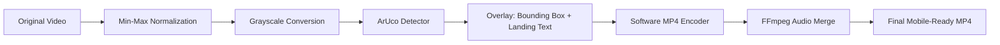

<div align="center">

# L&T EDGE AI: ArUco Landing System

### Computer Vision Pipeline for Autonomous Landing with Real-Time Marker Detection

**A robust detection system featuring low-light enhancement, automated dictionary scanning, and WhatsApp-ready video export**

</div>

---

## Overview

**L&T EDGE AI** is a specialized computer vision toolkit designed to solve ArUco marker detection challenges in adverse conditions—specifically focusing on **drone landing pads** under extreme low-light environments.

Unlike standard libraries that fail in the dark, this pipeline implements:

* **Min-Max Normalization** for digital "night vision"
* **Automatic Dictionary Discovery** (Scanning 4x4, 5x5, 6x6, and Original)
* **H.264/AAC Transcoding** for mobile and WhatsApp compatibility
* **Audio-Video Multiplexing** to preserve original sensor recordings

---

## Core Features

* **Extreme Low-Light Support**: Aggressive contrast stretching makes markers visible even in near-pitch-black footage.
* **High-Fidelity Detection**: Specifically optimized for ArUco `DICT_5X5_50` (ID: 17) used in landing pads.
* **WhatsApp Ready**: Outputs are automatically converted to `yuv420p` pixel format to prevent "Unsupported File" errors on mobile.
* **Failure Recovery**: Handles missing hardware encoders by falling back to software-based `mp4v` processing.

---

## Technical Pipeline



---

## Data Model & Logic

### Detection Parameters

| Parameter | Value | Purpose |
| --- | --- | --- |
| **Dictionary** | `DICT_5X5_50` | Targeted landing pad family |
| **Marker ID** | `17` | Verified landing pad unique identifier |
| **Normalization** | `NORM_MINMAX` | Digital gain for dark frames |
| **Pixel Format** | `yuv420p` | Mobile device compatibility |

### Video Processing Flow

1. **Brighten**: Pixel values are stretched from  to .
2. **Detect**: ArUco corners are identified using the 5x5 grid dictionary.
3. **Render**: A green bounding box and `"marker detected ....landing"` text are burned into the frame.
4. **Mux**: FFmpeg extracts the original audio from `lnt.mp4` and syncs it with the processed visual stream.

---

## Installation & Usage

### Dependencies

```bash
sudo apt update
sudo apt install ffmpeg
pip install opencv-contrib-python

```

### Running the System

Place your source video as `lnt.mp4` in the project root and execute:

```bash
python3 a.py

```

### Git Workflow

```bash
# Set identity
git config --global user.email "your@email.com"
git config --global user.name "Your Name"

# Push to Main
git add .
git commit -m "feat: implement normalization and audio muxing"
git branch -M main
git push -u origin main

```

---

## Project Structure

```
ARUCO/
├── arucotag/
│   ├── arucotag.png          # Original marker asset
│   ├── model.config          # Gazebo/SDF model configuration
│   └── model.sdf             # 3D model definition for simulation
├── scripts/
│   └── aruco_land.py         # Specialized autonomous landing logic
├── x500_mono_cam_down/
│   ├── model.config          # Drone camera configuration
│   └── model.sdf             # Drone sensor definition
├── a.py                      # Main detection, enhancement, and export script
├── aruco.sdf                 # Unified SDF for environment markers
├── final_landing_with_audio.mp4 # Final processed output with audio
└── lnt.mp4                   # Source input video

```

---

## Project Objectives

This system was built to demonstrate Edge AI capabilities in real-time robotics and autonomous systems.

### Key Concepts

* **Image Pre-processing**: Overcoming environmental noise and lighting constraints.
* **Distributed Encoding**: Managing hardware/software codec conflicts on Linux.
* **Mobile Integration**: Formatting data streams for real-world communication platforms.

---


**Team URS** 

